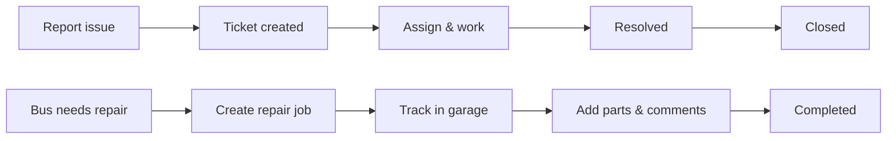

# Product overview

## What the application does

The **Samanvi Internal Tool** helps Samanvi teams manage day-to-day operations in one place:

1. **Report problems** — When a bus or route has an issue, staff create a **ticket** with details, severity, and due date.
2. **Track progress** — Supervisors and workers update status, assign work, and add comments until the issue is resolved.
3. **Maintain fleet data** — **Masters** hold bus numbers, routes (service numbers), drivers, helpers, and office staff used across the system.
4. **Run the garage** — **Repair jobs** record odometer readings, repair type, spare parts, and job status from creation through completion.
5. **Control access** — **Application Access** lets authorized staff create login accounts and choose what each person can view or change.

---

## Main business purpose

Samanvi moves people by bus. This tool supports that mission by:

- Making issues visible quickly so they can be fixed.
- Showing who is responsible and when work is due (SLA).
- Keeping bus and crew information consistent for tickets and repairs.
- Giving managers dashboards and boards to see workload and bottlenecks.

---

## Key benefits

| Benefit | How Samanvi helps |
|---------|-------------------|
| **Faster response** | Tickets have priority, severity, and SLA due dates. |
| **Clear ownership** | Assign tickets and repair jobs to specific people. |
| **Audit trail** | Timelines show status changes, comments, and who acted. |
| **One source of truth** | Masters data is shared by tickets, garage, and reports. |
| **Flexible access** | Permissions control who sees tickets, garage, or masters. |

---

## Main user roles

The app uses **two related ideas**:

### Ticket roles (on your profile)

Used when working on **tickets**:

| Role | Summary |
|------|---------|
| **Admin** | Full ticket control; access to board, users, and advanced ticket lists |
| **Supervisor** | Same ticket workflow as admin; can manage buses |
| **Worker** | Can update status and comment on assigned work |
| **Viewer** | Read-only on tickets |

### Application user types (on Application Access)

Used when **creating accounts**:

Supervisor, Chairman, Accountant, Collection Agent, Worker, and **Admin**. Admins receive all permissions automatically.

See [Roles and permissions](../roles-and-permissions.md) for detail.

---

## Core workflows

### Ticket lifecycle (typical)

1. Someone **creates a ticket** with bus number, category, and description.
2. A supervisor **assigns** it to a worker (optional at create time).
3. Status moves: **Created → Assigned → In progress → Resolved → Closed**.
4. If needed, a closed ticket can be **reopened**.

### Garage lifecycle (typical)

1. Staff **create a repair job** with bus, odometer, category, and description.
2. Job may be **assigned** to office staff in the garage.
3. Status moves through **created, assigned, in progress**, and may go **on hold** before **completed** or **cancelled**.
4. **Spare parts** and **comments** are added on the job details page.
5. **Repeat jobs** can be scheduled for follow-up maintenance.

### Masters (ongoing)

Administrative users keep **buses**, **routes**, **crew**, and **service types** up to date so tickets and garage forms show correct choices.

---

## What you see after login

Your **sidebar** only shows areas your account is allowed to use. Common groups:

- **Home** — Greeting and workspace entry
- **Navigation** — Application Access, Settings, and sometimes Dashboard or Tickets (if enabled for your account)
- **Masters** — Service For, Bus No, Service No, Employees
- **Garage** — Create Repair Job, Repair Tracking, Reports, Garage Masters

If you expected a menu item and do not see it, see [Roles and permissions](../roles-and-permissions.md) or ask your administrator.

---

## Next steps

- [Access and login](access-and-login.md)
- [Navigation](navigation.md)
- [First steps](first-steps.md)
