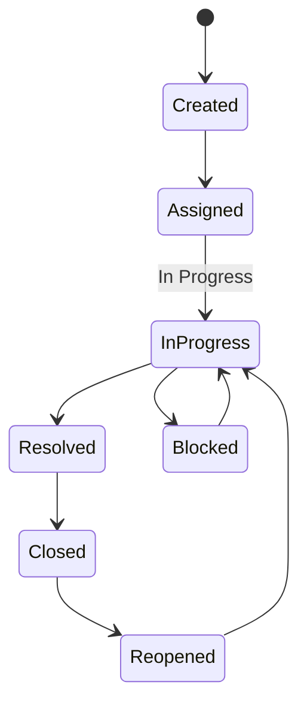

# Workflow: Manage ticket status

Move a ticket from report to resolution and close.

---

## Status flow (typical)

---

## Who does what

| Step | Typical owner | Action |
|------|---------------|--------|
| Triage | Supervisor | Assign ticket |
| Start work | Worker | Set **In Progress** |
| Blocked | Worker/Supervisor | Set **Blocked** with note |
| Fix complete | Worker | Set **Resolved** with note |
| Confirm & close | Supervisor | Set **Closed** |
| Reopen | Supervisor/Admin | **Reopened** from **Closed** only |

---

## Method A: Ticket details page

1. Open the ticket from **Tickets** or **Dashboard**.
2. Click **Update status**.
3. Select new status.
4. Enter **note** (required for **Resolved**).
5. Confirm.

### Assignment (if needed)

1. Click **Update assignment**.
2. Choose user and optional note.
3. Save.

### Comment (optional)

1. Use **Add comment** for updates that are not status changes.
2. Submit.

---

## Method B: Board (admins only)

1. Open **Board**.
2. Drag the card to the target column.
3. Enter note when prompted (required for **Resolved**).
4. Confirm.

> **Remember:** You cannot drag from **In Progress** directly to **Closed**.

---

## Rules checklist

- [ ] **Resolved** always has an explanation note.
- [ ] Go through **Resolved** before **Closed** from **In Progress**.
- [ ] **Reopened** only when ticket was **Closed**.
- [ ] Workers cannot assign—ask a supervisor.

---

## Expected outcomes

| Status | What it means for the team |
|--------|----------------------------|
| **Assigned** | Owner accountable |
| **In Progress** | Active work |
| **Blocked** | Waiting—needs follow-up |
| **Resolved** | Fix applied; may need verification |
| **Closed** | Done; no further action |
| **Reopened** | Issue returned; treat as active |

---

## Troubleshooting

| Problem | Cause | Fix |
|---------|-------|-----|
| Cannot change status | Viewer role or no permission | Request update_status permission |
| Reopened missing | Ticket not closed | Close first, then reopen |
| Resolved rejected | Empty note | Add resolution details |

---

## Related guides

- [Ticket details](../features/ticket-details.md)
- [Board](../features/board.md)
